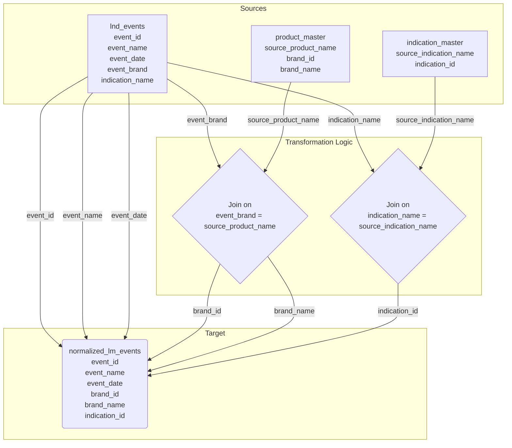
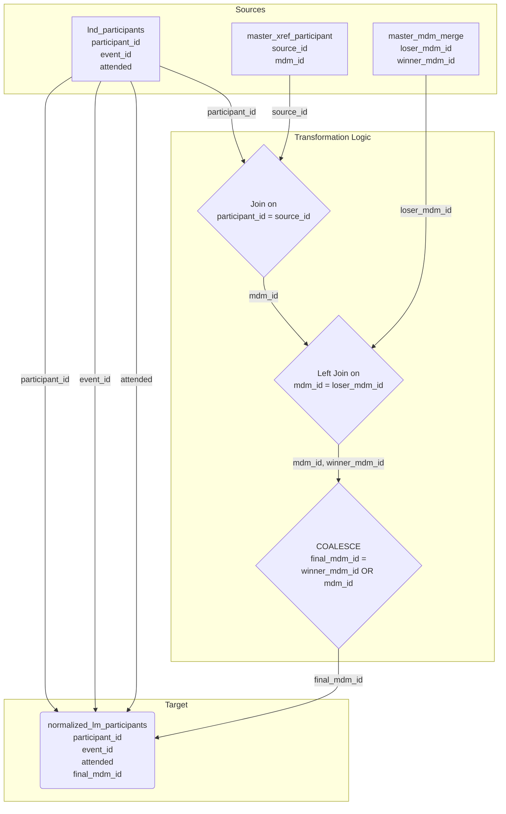

# Column-Level Data Lineage

This document provides a detailed, column-level view of the data lineage, showing how individual fields are transformed and populated across the pipeline's layers. For clarity, the lineage is broken down by each major target table.

---

## 1. Lineage for `normalized_lm_events`

This diagram shows how the `normalized_lm_events` table is constructed from the landing layer event table and enriched with master data.



---

## 2. Lineage for `normalized_lm_participants`

This diagram illustrates how the `normalized_lm_participants` table is created, focusing on the logic to resolve the master participant ID (`final_mdm_id`).



---

## 3. Lineage for `event_performance_kpi` (Summarized)

This diagram shows how columns from the two normalized tables are aggregated to produce the `event_performance_kpi` table.

```mermaid
graph TD
    subgraph Sources (Normalized Layer)
        A[normalized_lm_events<br>event_id<br>event_date]
        B[normalized_lm_participants<br>participant_id<br>attended<br>event_id]
    end

    subgraph Transformation Logic
        T1{Join on event_id}
        T2{Group By event_date}
        T3{AGGREGATIONS<br>COUNT_DISTINCT(event_id)<br>COUNT(participant_id)<br>SUM(attended)}
    end

    subgraph Target (Summarized Layer)
        C{{event_performance_kpi<br>event_date<br>total_events<br>total_registrations<br>total_attendees}}
    end

    %% Join & Grouping
    A -- event_id --> T1
    B -- event_id --> T1
    A -- event_date --> T1
    T1 -- grouped by event_date --> T2
    T2 -- event_date --> C

    %% Aggregations
    T1 -- event_id --> T3
    T3 -- total_events --> C
    T1 -- participant_id --> T3
    T3 -- total_registrations --> C
    T1 -- attended --> T3
    T3 -- total_attendees --> C
```
