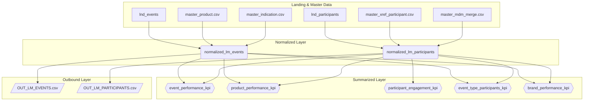

# Data Lineage Diagram

This document illustrates the data flow and dependencies between the tables across the different layers of the pipeline.

## Mermaid Diagram

## Lineage Explanation

1.  **Landing to Normalized**:
    *   `normalized_lm_events` is created by enriching `lnd_events` with data from `master_product` and `master_indication`.
    *   `normalized_lm_participants` is created by enriching `lnd_participants` with master data from `master_xref_participant` and `master_mdm_merge` to get a consistent master ID.

2.  **Normalized to Summarized**:
    *   All five KPI tables in the **Summarized Layer** are derived from a join between the `normalized_lm_events` and `normalized_lm_participants` tables.
    *   The `participant_engagement_kpi` table is the only one that primarily uses the `normalized_lm_participants` table, but it is still conceptually linked to the overall event context.

3.  **Normalized to Outbound**:
    *   The outbound CSV files are direct, filtered exports from the two main tables in the **Normalized Layer**. `OUT_LM_EVENTS.csv` comes from `normalized_lm_events`, and `OUT_LM_PARTICIPANTS.csv` comes from `normalized_lm_participants`.
